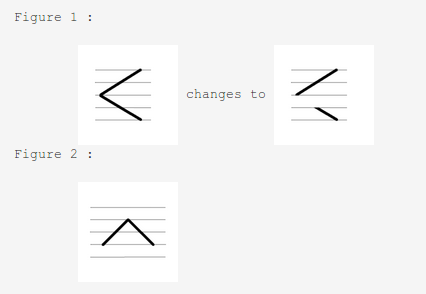

**Scan Line Polygon Fill Algorithm**  

Pseudo Code of the algorithm  
Input : Vertices of the polygon, (xi, yi) ∀i = {1, 2, ..., n}, n = #vertices in the polygon. We have the following data structures to maintain data:     

- Edge Table (ET) : Contains all the edges (except horizontal edges) of the polygon sorted by their smaller y-coordinates. All the edges having equal smaller y-coordinates are kept in the same bucket, where they are sorted by the corresponding x-coordinate.  
 In each cell, the following information is maintained:  
   i. y_upper : last scanline to consider for this edge    
   ii. x_lower : corresponding x coordinate for the smaller value y value of the edge    
   iii. 1/m : to compute the corresponding x coordinate of the edge for each scanline     
- Active Edge Table (AET) : Contains the edges that intersect with the current scan line. For each scan line, the edges are sorted in an increasing order of the x coordinate of the point of intersection.  
 In each cell, the following information is maintained:  
   i. y_upper : last scanline to consider for this edge  
   ii. x_lower : x coordinate value of the edge for the present scan line  
    iii. 1/m : to compute the corresponding x coordinate of the edge for each scanline  

**Steps of the Algorithm**  

    1. AET is initially empty.   
    2. scan_value = Value of y-coordinate for the first nonempty bucket. This is the first scan line from where filling will start.   
    3. Do  
        	
       - From ET[scan_value] bucket, all entries are inserted in AET which satisfy the condition : ymin = scan_value. This is to include the new edges which have their smaller y value equal to the present scan line.  
        	
       - From AET, remove the entries which satisfy the condition, ymax = scan_value, i.e., remove the edges not intersecting with the next scanline  

       - Please note that there will be one entry for edges in Fig. 1 and two entries for edges in Fig. 2  
	
	

        	
        	
       - Sort all the entries in AET w.r.t. the x-coordinate of the intersection point of the edge with the present scan line.  
        	
       - Fill the pixels in the present scanline from x-values mentioned in the odd entries of AET to the x-values mentioned in the next even entry of AET.  

        	If there are n entries in AET (n will always even), then the following pixels will be filled :  

 
            	    
            - 1st entry to 2nd entry

            	    
            - 3rd entry to 4th entry

            	    
            - ... 

            	    
            - (n-1)th entry to nth entry

            	
       - Increment y by 1 (to the coordinate of the next scanline).  

        	
       - For each nonvertical edge remaining in the AET, update x for the new y.  

    Until AET and ET are non empty  

